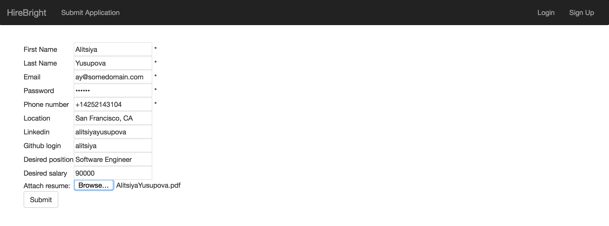
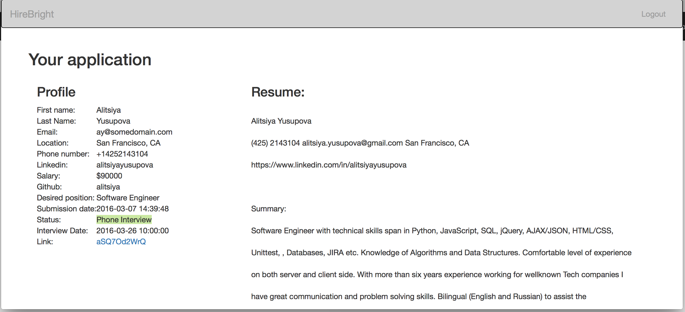
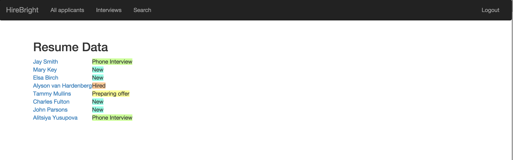
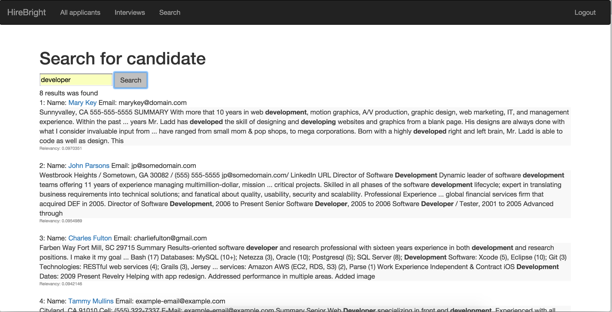
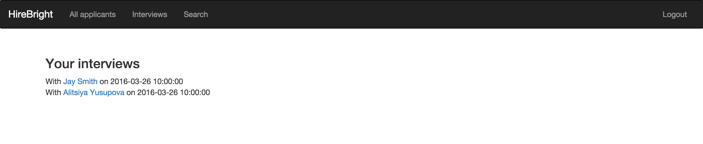
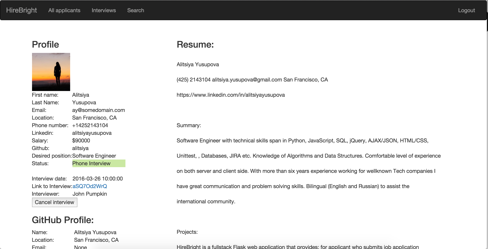
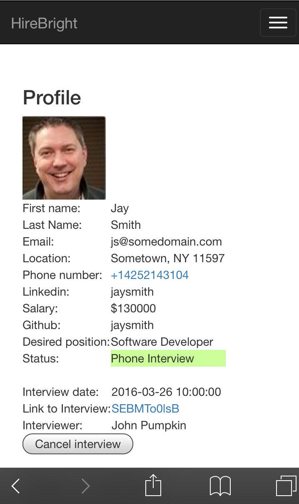

#Project Description
**HireBright** is an app that helps to connect applicants with recruiters. As an applicant you can submit your application and txt or pdf of your resume and see your application status. As a recruiter you have access to data of all applicants, you can schedule and cancel interviews, search for applicants and see results ordered by relevancy, see your upcoming and past interviews, and see applicant GitHub profile and resume. It has a pair programming tool to solve code challenges remotely in real time. The app also sends an SMS when an interview is scheduled via Twilio API. Passwords in database are encrypted using *Bcrypt*.

#Setup
##Dependencies and Compatibility

**OSX** Install PostgreSQL.

Use Sublime to edit the file in your home directory named .bash_profile:

``` $ subl ~/.bash_profile ``` 

Then, at the bottom of this file, add the following line (exactly):

``` export PATH=/Applications/Postgres.app/Contents/Versions/9.4/bin/:$PATH ``` 


##Installation
Clone repository

Create a virtual environment for the project 
``` $ virtualenv env ```

Activate the environment 
``` $ source env/bin/activate ```

Install requirements
``` $ pip install -r requirements.txt ```
    
To access Twilio functionality, you should have [twilio API keys](https://www.twilio.com/docs/api/rest/sending-messages) and store them in secrets.sh file.

Create database with the name 'interviewer', run model.py
``` python -i model.py ``` and type ```db.create_all()``` or ``` psql interviewer < database.sql ```

Type in command line ``` source secrets.sh ``` for your app to have access to keys

To be able to submit pdf files on "Submit Application" page, make sure your machine has 'pdftotext' or 'brew' it to you Mac, it's free.

To run the app from the command line of the terminal, run 
``` $ python server.py ```

In a browser window, type localhost:5000 to access the home page

##Testing
There is tests.py file that cover some percentage of model.py and server.py code.
For testing use command line:
` coverage run tests.py `
For report: 
` coverage report -m server.py `
Also this will run Selenium script that will automaticlly run Firefox and fill out applcation page.

#Data
You can generate your own data for applicants and recruiters. Also you can seed database.sql file into database `psql interviewer < database.sql` .  

#Usage
App designed for two types of users: applicants and recruiters. 
+ To sign up as applicant you have to submit job application. After that you'll be redirected to "Your application" page. This page has interview status and link to remote pait programming tool if interview was scheduled. You can review you application and delete your profile from here. 
+ To sign up as recruiter use sign up page with a secret (for now it's a word 'secret'). You have access to all applicant profiles, you can schedule interview, access your upcomming interviews, search for candidates. 


Applicant UI:


As recruiter UI:

Search implemented using PostgreSQL Full Text Search. On every search query row of resume strings converted to a sorted list of distinct lexemes. Query also converts to lexem, so when searching for 'developer' as the result you'll also get all forms of that word. Search form supports more than one search term. It handles multiply terms by searching 'term1 OR term2 OR' etc. 
Relevancy is another PostgreSQL build-in method. The more lexems are in document the higher rank will be. 
PostgreSQL allows to get document snippets with keyword highlighted. In HireBright it specified that snippet has no more than three chunks with maximum 30 words in each.



App also has fully functional mobile version.



#Tech Stack
Python, Flask, Websockets, JavaScript, AJAX/JSON, SQL, SQLAlchemy, PostgreSQL Full Text Search, Bcrypt, Bootstrap, HTML, CSS

#APIs Used
Twilio API, Github API

#Developer
**Alitsiya Yusupova** lives in San Francisco, CA. Check out her profile on [LinkedIn](https://www.linkedin.com/in/alitsiyayusupova).
